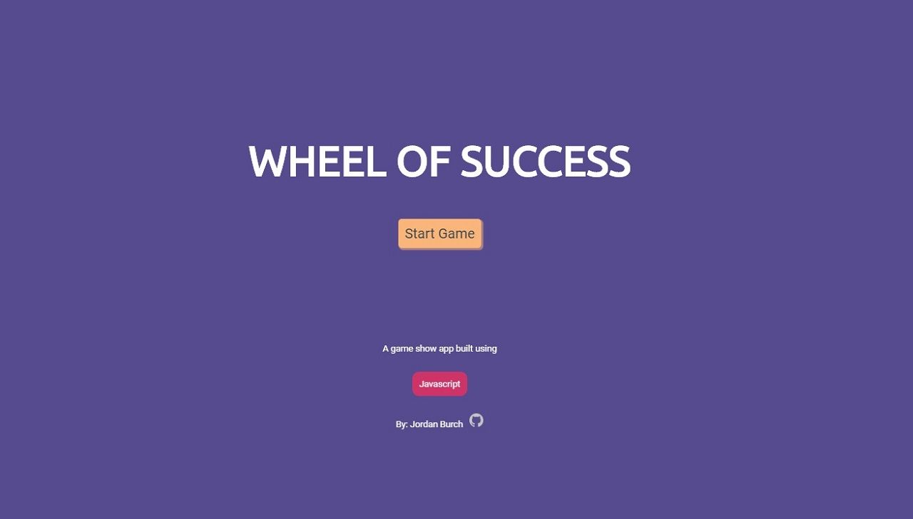
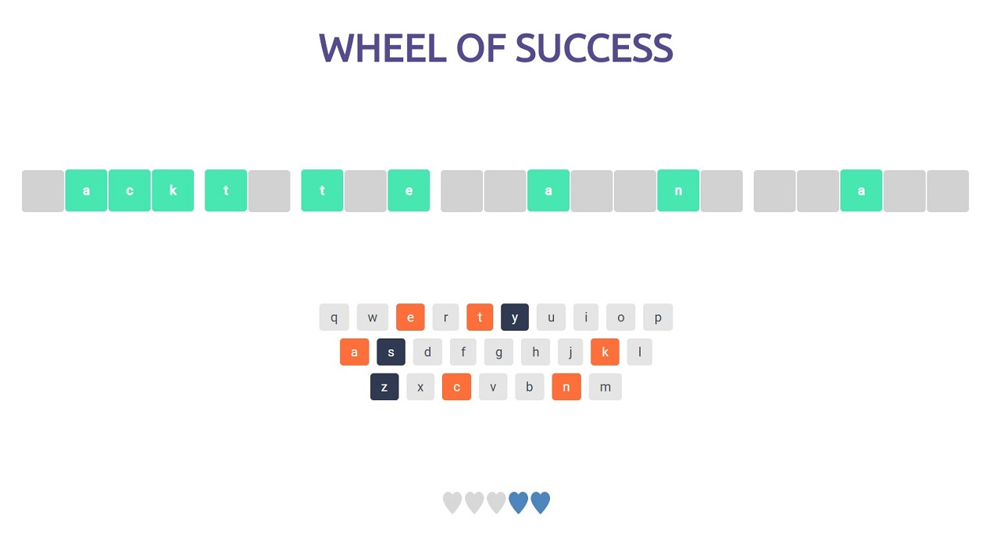
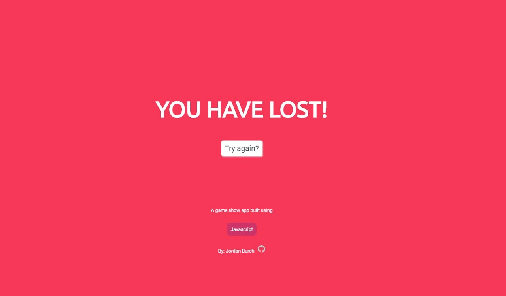

# Teachdegree-project 6
> A browser version of "Wheel of Success", a word guessing game where players will click letters from an onscreen keyboard to try guess a random phrase.

## Table of contents
* [General info](#general-info)
* [Screenshots](#screenshots)
* [Technologies](#technologies)
* [Features](#features)
* [Contact](#contact)

## General info
This project demonstrates my use of JavaScript to choose a random phrase from an array, split the phrase into letters, and then puts those letters onto the game board.

If the player completes the phrase before they run out of guesses, a winning screen will display. If the player guesses incorrectly 5 times, a losing screen will display.

## Screenshots

## Technologies
* JavaScript
* CSS3
* HTML5

## Features
List of features ready and TODOs for future development
* Functioning win or lose conditions
* Use of multiple event listeners
* Ability to restart the game after a win or lose

To-do list:
* Add more phrases to the array
* Add a 'clue' to the gameboard to help users figure out the phrase

## Contact
Created by [@JordanBurch101](https://github.com/Jordanburch101) - feel free to contact me!